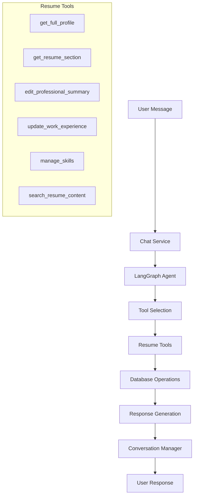

# AI Agent System - Resume Builder

## Overview

The Resume Builder uses an advanced AI agent system built on **LangGraph** and **OpenAI's GPT models** to provide intelligent, conversational resume editing capabilities. This document explains the agent architecture, behavior patterns, and system goals.

## 🎯 System Goals

### Primary Objectives

1. **Natural Language Resume Editing**: Enable users to modify their resumes through conversational interfaces
2. **Intelligent Tool Orchestration**: Automatically select and execute appropriate tools based on user intent
3. **Context-Aware Interactions**: Maintain conversation context and provide personalized responses
4. **Direct Data Modification**: Make actual changes to the resume database, not just suggestions
5. **Comprehensive Change Tracking**: Log all modifications with timestamps and user attribution

### Secondary Objectives

1. **Session Management**: Maintain persistent conversations across multiple interactions
2. **Error Handling**: Gracefully handle tool failures and provide helpful feedback
3. **Performance Monitoring**: Track tool usage patterns and execution times
4. **Scalable Architecture**: Support multiple concurrent users and conversations

## 🏗️ Agent Architecture

### Core Components



### Service Layer Architecture

#### 1. **ChatService** (`chat_service.py`)

- **Role**: Main orchestrator and LangGraph agent controller
- **Responsibilities**:
  - Message processing and routing
  - Tool binding and execution
  - Response generation and formatting
  - Error handling and logging

#### 2. **ResumeEditingTools** (`resume_tools.py`)

- **Role**: Tool implementations for resume operations
- **Responsibilities**:
  - Database CRUD operations
  - Data validation and formatting
  - Change tracking and versioning
  - Business logic enforcement

#### 3. **ConversationManager** (`conversation_manager.py`)

- **Role**: Session and history management
- **Responsibilities**:
  - Chat session persistence
  - Conversation history retrieval
  - Context window management
  - User session tracking

#### 4. **ContextManager** (`context_manager.py`)

- **Role**: Context optimization and management
- **Responsibilities**:
  - Token limit management
  - Context prioritization
  - Memory optimization
  - Performance tuning

## 🛠️ Tool System

### Available Tools

| Tool Name | Purpose | Input Parameters | Output |
|-----------|---------|------------------|--------|
| `get_full_profile` | Retrieve complete user profile | `user_id` | Full resume data object |
| `get_resume_section` | Get specific resume section | `user_id`, `section_name` | Section-specific data |
| `edit_professional_summary` | Update professional summary | `user_id`, `new_summary` | Success/error status |
| `update_work_experience` | Modify work experience | `user_id`, `experience_data`, `action` | Updated experience list |
| `manage_skills` | Add/edit/remove skills | `user_id`, `skills_data`, `action` | Updated skills object |
| `search_resume_content` | Search through resume | `user_id`, `query` | Search results |

### Tool Selection Logic

The agent uses the following decision tree for tool selection:

1. **Information Requests** → `get_full_profile` or `get_resume_section`
2. **Specific Edits** → Corresponding edit tools (`edit_*`, `update_*`, `manage_*`)
3. **Search Queries** → `search_resume_content`
4. **Complex Operations** → Multiple tool chain execution

## 🧠 Agent Behavior Patterns

### Conversation Flow

```text
User Message → Intent Analysis → Tool Selection → Execution → Response Generation
```

#### 1. **Intent Analysis**

- Classify user message type (question, edit request, search, etc.)
- Extract key parameters (section names, content, actions)
- Determine required tool chain

#### 2. **Tool Execution Strategy**

- **Read-First Pattern**: Get current data before making changes
- **Validation Pattern**: Validate inputs before database operations
- **Chain Execution**: Execute multiple tools in logical sequence
- **Error Recovery**: Handle tool failures gracefully

#### 3. **Response Generation**

- **Confirmation Pattern**: Confirm successful changes
- **Data Presentation**: Format and present retrieved data
- **Clarification Pattern**: Ask for clarification when needed
- **Suggestion Pattern**: Offer related improvements

### Current Behavior Analysis

#### ✅ Working Correctly

- Tool binding and availability
- Basic tool execution
- Logging and monitoring
- Session management
- Database operations

#### ⚠️ Areas for Improvement

- **Tool Selection Bias**: Agent tends to use read tools over edit tools
- **Action Confidence**: Sometimes suggests instead of acting
- **Multi-step Operations**: Complex edits may need better orchestration

## 📊 Monitoring and Observability

### Comprehensive Logging System

The system implements multi-level logging with the following markers:

- `🔧 TOOL ACTIVITY`: Tool selection and execution tracking
- `⏱️ TOOL TIMING`: Performance monitoring
- `📊 TOOL RESULT`: Execution outcome tracking
- `📈 TOOL USAGE PATTERN`: Usage pattern analysis
- `✏️ DATA MODIFICATION`: Change detection
- `❌ TOOL FAILED`: Error tracking

### Metrics Collected

1. **Performance Metrics**
   - Tool execution times
   - Response generation latency
   - Database query performance

2. **Usage Metrics**
   - Tool selection frequency
   - User interaction patterns
   - Session duration and depth

3. **Error Metrics**
   - Tool failure rates
   - Error types and frequency
   - Recovery success rates

## 🎮 User Interaction Patterns

### Supported Interaction Types

#### 1. **Direct Questions**

- "What's my current job title?"
- "Show me my technical skills"
- "What's in my professional summary?"

#### 2. **Edit Requests**

- "Add Python to my skills"
- "Update my job title to Senior Engineer"
- "Change my summary to focus on leadership"

#### 3. **Complex Operations**

- "Improve my resume for a data science role"
- "Add my recent project experience"
- "Optimize my skills for ATS systems"

### Response Strategies

#### 1. **Information Responses**

- Present data in readable format
- Highlight key information
- Offer related suggestions

#### 2. **Confirmation Responses**

- Confirm successful changes
- Show before/after comparisons
- Suggest follow-up actions

#### 3. **Clarification Responses**

- Ask specific questions when context is unclear
- Provide options when multiple interpretations exist
- Guide users toward successful interactions

## 🔮 Future Enhancements

### Planned Agent Improvements

1. **Multi-Modal Capabilities**
   - PDF import and analysis
   - Image-based resume parsing
   - Voice interaction support

2. **Advanced Reasoning**
   - Industry-specific optimization
   - ATS compatibility analysis
   - Career progression recommendations

3. **Collaborative Features**
   - Multi-user editing sessions
   - Peer review workflows
   - Expert consultation integration

4. **Personalization Engine**
   - Learning user preferences
   - Adaptive suggestion algorithms
   - Context-aware recommendations

### Technical Roadmap

1. **Enhanced Tool System**
   - More granular editing tools
   - Batch operation support
   - Undo/redo functionality

2. **Improved Agent Logic**
   - Better intent classification
   - Multi-step planning capabilities
   - Proactive suggestion engine

3. **Performance Optimization**
   - Caching strategies
   - Parallel tool execution
   - Response time optimization

## 🛡️ Security and Privacy

### Data Protection

- User data isolation
- Secure database operations
- Audit trail maintenance

### AI Safety

- Input validation and sanitization
- Output content filtering
- Rate limiting and abuse prevention

### Privacy Compliance

- User consent management
- Data retention policies
- Export and deletion capabilities

---

**Last Updated**: September 26, 2025  
**Version**: 1.0  
**Status**: Active Development
